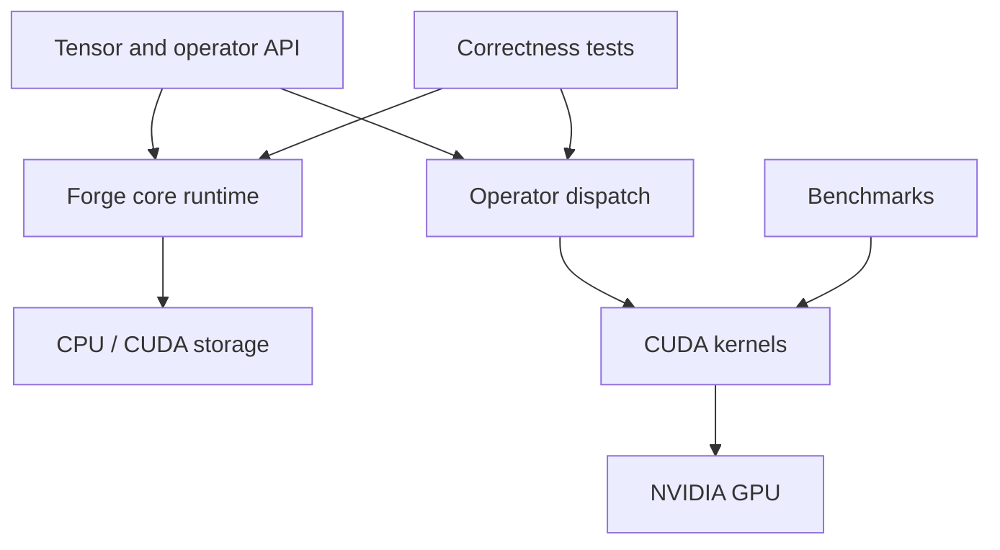

# Forge

**A from-scratch C++/CUDA inference-runtime project focused on GPU execution, correctness, and measurable performance.**

Forge is being built layer by layer—from tensors and CUDA kernels to operators, execution scheduling, memory reuse, and mixed-precision inference. The repository keeps baseline implementations and benchmark evidence visible so each optimization can be measured rather than assumed.

## Current implementation

- C++20 tensor abstraction with CPU and CUDA storage
- Host-to-device and device-to-host tensor transfers
- CUDA vector-add kernel and benchmark
- CUDA matrix-multiplication kernel
- Matrix-multiplication operator dispatch
- Tensor and matrix-multiplication correctness tests
- Separate CMake targets for runtime, CUDA backend, operators, tests, and benchmarks

## Architecture



## Build

Requirements:

- CMake 3.24+
- A C++20 compiler
- NVIDIA CUDA Toolkit
- CUDA-capable NVIDIA GPU

The default CUDA architecture is compute capability 7.5 (Tesla T4). Override `CMAKE_CUDA_ARCHITECTURES` for other GPUs.

```bash
cmake -S . -B build -DCMAKE_BUILD_TYPE=Release
cmake --build build -j
```

Run correctness tests:

```bash
./build/forge_tensor_test
./build/forge_matmul_test
```

Run benchmarks:

```bash
./build/forge_vector_add
./build/forge_matmul_benchmark
```

## Baseline results

Measured on an NVIDIA Tesla T4 (compute capability 7.5). These results establish the unoptimized baseline for later kernel work.

### Vector addition

| Elements | Best observed time | Effective bandwidth |
|---:|---:|---:|
| 1,048,576 | ~0.051 ms | ~248 GB/s |
| 4,194,304 | ~0.193 ms | ~261 GB/s |

### Naive matrix multiplication

20 benchmark iterations per size.

| Matrix size | Kernel time | Throughput |
|---:|---:|---:|
| 256 × 256 | 0.1571 ms | 213.54 GFLOP/s |
| 512 × 512 | 0.6943 ms | 386.65 GFLOP/s |
| 1024 × 1024 | 5.4875 ms | 391.34 GFLOP/s |
| 2048 × 2048 | 34.7110 ms | 494.94 GFLOP/s |

> These are baseline kernel measurements, not comparisons against cuBLAS. Future results will report speedups only against clearly defined and reproducible baselines.

## Repository layout

```text
forge/
├── benchmarks/       # CUDA microbenchmarks
├── cuda/             # CUDA kernels and launch interfaces
├── docs/             # Architecture and experiment notes
├── include/forge/    # Public runtime and operator headers
├── src/              # Runtime and operator implementations
├── tests/            # Correctness tests
└── CMakeLists.txt
```

## Roadmap

- [x] Tensor abstraction and CPU/CUDA memory transfers
- [x] Vector-add baseline and bandwidth benchmark
- [x] Naive GEMM baseline, operator, tests, and benchmark
- [ ] Shared-memory tiled GEMM
- [ ] Activation and softmax kernels
- [ ] FP16 execution and Tensor Core path
- [ ] GPU memory pool and tensor-lifetime reuse
- [ ] Computation graph and execution scheduler
- [ ] CUDA streams, batching, and asynchronous execution
- [ ] Operator fusion
- [ ] NVIDIA Nsight profiling and bottleneck reports
- [ ] Multi-GPU execution experiments

## Benchmark discipline

Each optimization should include:

1. A correctness test.
2. A reproducible benchmark configuration.
3. Hardware and software environment details.
4. Latency and throughput before and after the change.
5. A short explanation of the measured bottleneck and tradeoff.
